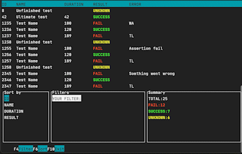
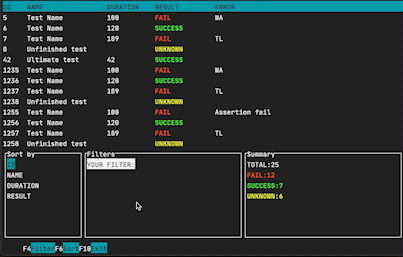

# Test Runs Results Aggregation

Implementation of a (toy) test results aggregator using C++ and ncurses libray. 

## Functionality
`aggregator` can disply your tests results, filter them by keywords and sort.

### Sort

### Filter


## Build and run
### CMake

Note that this option is only possible on linux and mac.

For it to work you need to have `ncurses` library on your machine.

Run this in the root of the project:

```sh
mkdir build
cd build
cmake ..
cmake --build .
```

Example of tests results are in file `input.txt`.

`aggregator` takes the tests results from standart input, so just run:

```sh
./aggregator < ../input.txt
```

### Docker

You can use a docker image:

```sh
docker pull meramiha/aggregator
docker run -it --rm meramiha/aggregator
```

